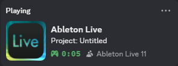

# 🎹 ableton-live-presence

A simple Python script that displays Ableton Live (all versions) in Discord Rich Presence.



## 🛠️ Installation

1. Make sure you have Python installed and install the dependencies:
    ```bash
    pip install -r requirements.txt
    ```

2. Copy `ableton-presence.bat` script to your Windows startup folder.
    ```
    %AppData%\Microsoft\Windows\Start Menu\Programs\Startup
    ```

3. Edit `ableton-presence.bat` so it points to where `ableton-presence.py` is located.
    ```bash
    @echo off
    start pythonw.exe "C:\Users\YourName\github\ableton-presence\ableton-presence.py"
    ```

## 🙏 Thanks

- [pypresence](https://github.com/qwertyquerty/pypresence)
